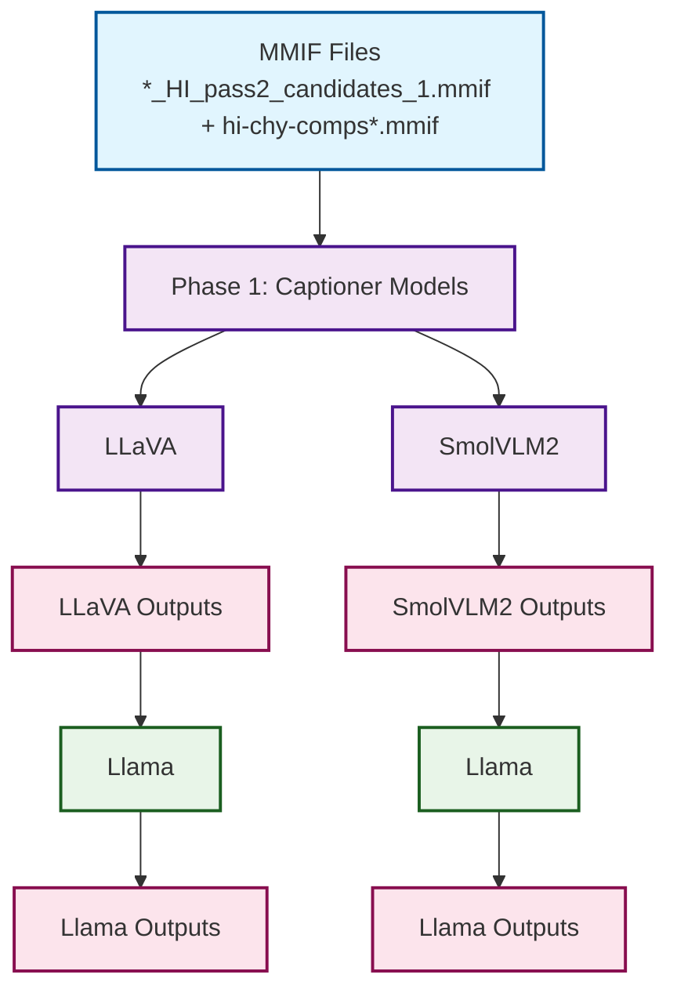

# CLAMS Pipeline Architecture

This diagram shows the complete pipeline structure implemented in `run_clams_pipeline.sh`.

## Pipeline Overview

## Pipeline Phases

### Phase 1: Captioner Models
- **LLaVA**: Processes video files to generate captions
- **SmolVLM2**: Alternative captioning model running in parallel
- **Processing**: Both models run simultaneously for each video file

### Phase 2: Llama Video Summarizer
- **Input**: Captioner outputs from Phase 1
- **Processing**: Sequential processing after all captioner outputs are complete

## Dataset Types

- **Main Dataset**: `mmif/*_HI_pass2_candidates_1.mmif` files
- **Comparison Dataset**: `comps_mmif/*.mmif` files (processed from external source)
- **Unified Processing**: Both datasets follow the same pipeline flow

## Execution Modes

- **CLI Mode**: Direct execution of Python scripts
- **Service Mode**: HTTP requests to running services on specified ports

## Key Features

- **Parallel Processing**: Captioner models run simultaneously
- **Dependency Management**: Later phases wait for captioner completion
- **Multiple Runs**: Support for multiple execution runs with run-specific output directories
- **Error Handling**: Individual model failures don't stop the entire pipeline
- **GPU Monitoring**: GPU utilization logging during processing
